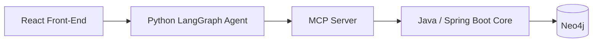

# Knowledge Graph

A knowledge-graph platform built with a spec-driven development process: a Java/Spring Boot
graph core (source of truth) backed by Neo4j, an MCP server exposing that API as tools, a
Python LangGraph agent that orchestrates those tools, and a React front-end — each built as an
independent, incrementally-delivered slice.

See [.specify/memory/constitution.md](.specify/memory/constitution.md) for the project's
governing principles and full technology stack, and [specs/](specs/) for every feature's
spec/plan/tasks.

## Architecture



| Layer | Status | Location |
|---|---|---|
| Java core (entity/relationship CRUD + schema, Neo4j) | ✅ Implemented | [java-core/](java-core/) |
| MCP server (exposes the Java API as MCP tools) | Not started | future slice |
| Python LangGraph agent (agentic tool-use orchestrator) | Not started | future slice |
| React front-end (visualization, search, chat, admin CRUD) | Not started | future slice |

Only the Java core is built so far; the other layers are separate, later feature slices per the
constitution's MVP-first delivery principle (see Development Workflow below).

## Repository Structure

```text
.specify/            Spec Kit tooling, memory (constitution), templates
specs/                Per-feature spec.md / plan.md / tasks.md / research.md / contracts/
java-core/            Java/Spring Boot graph core (implemented)
.github/skills/       Spec Kit slash-command definitions
```

## Prerequisites

For the implemented layer (`java-core/`):

- Java 21 (JDK)
- Maven 3.9+
- Docker (for Neo4j locally and for Testcontainers-based integration tests)

Future layers will additionally need Python 3.12+ (with `uv`) for the agent, and Node.js/React
for the front-end — not required yet.

## Build & Run

```powershell
cd java-core
docker compose up -d
$env:APP_SECURITY_API_KEY = "local-dev-key"   # must match application.yml's app.security.api-key
mvn spring-boot:run
```

The API listens on `http://127.0.0.1:8080`. Every request to `/entities`, `/relationships`,
`/entity-types`, and `/relationship-types` requires an `X-API-Key: local-dev-key` header
(Constitution Principle IV's minimum interim auth bar — OAuth2/JWT is a later, dedicated
security slice).

- Swagger UI: `http://127.0.0.1:8080/swagger-ui.html`
- OpenAPI JSON: `http://127.0.0.1:8080/v3/api-docs`

Full details, including a scenario-by-scenario validation walkthrough, are in
[java-core/README.md](java-core/README.md) and
[specs/001-entity-crud-schema/quickstart.md](specs/001-entity-crud-schema/quickstart.md).

## Test

```powershell
cd java-core
mvn verify                                     # unit tests + Testcontainers integration tests (excludes @Tag("perf"))
mvn verify -Dsurefire.excludedGroups=          # also includes the 1M-entity/5M-relationship performance test
```

### Windows + Docker Desktop troubleshooting

If Testcontainers-based integration tests fail with `Could not find a valid Docker environment`
or a `BadRequestException` full of empty/zero fields, Docker Desktop's default Windows named-pipe
transport may not be negotiating correctly with the bundled `docker-java` client's default API
version. Workaround used during initial development:

1. Docker Desktop → Settings → General → enable **"Expose daemon on tcp://localhost:2375 without
   TLS"** and restart Docker Desktop. (Trade-off: any local process can then control Docker
   unauthenticated. Fine for a personal dev machine; don't do this on a shared machine.)
2. Run tests with:

   ```powershell
   $env:DOCKER_HOST = "tcp://127.0.0.1:2375"
   mvn verify "-Dapi.version=1.45"
   ```

## Development Workflow

This project uses [Spec Kit](https://github.com/github/spec-kit) for spec-driven development.
Each architectural layer is its own feature slice:

1. `/speckit-specify` — describe the feature (what/why, not how)
2. `/speckit-clarify` — resolve ambiguities before planning (required when a slice touches a
   cross-language contract or security boundary)
3. `/speckit-plan` — technical plan, constitution compliance check, contracts, data model
4. `/speckit-tasks` — dependency-ordered task breakdown
5. `/speckit-analyze` — cross-artifact consistency check before implementing
6. `/speckit-implement` — build it
7. `/speckit-converge` — catch up tasks.md with any drift before moving on

See [specs/001-entity-crud-schema/](specs/001-entity-crud-schema/) for a complete worked example
of every artifact this process produces.
